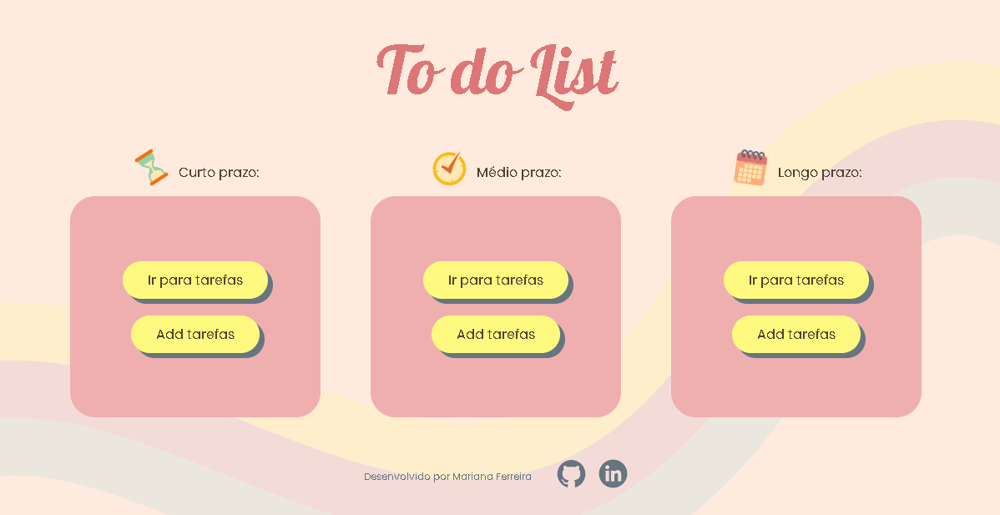
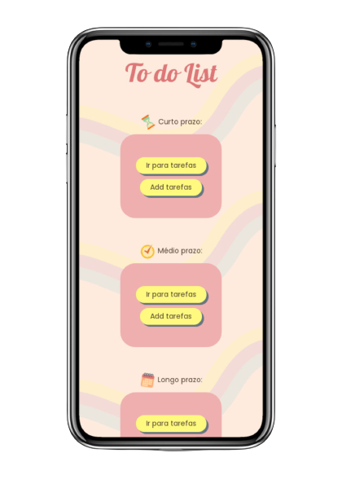

<br />
<p align="center">
  <h1 align="center">To do List</h1>

  <p align="center">
    Programa desenvolvido para gerenciamento de tarefas divididas por prazo, utilizando o Local Storage que possibilita o armazenamento dessas tarefas, com a possibilidade de marca-las como concluídas e exclui-las.
  </p>
  <br />
</p>


## Sobre o Projeto

<br />
<div align="center">
  <h2>Versão Desktop </h2>
  <br />
  
  <br />
  <br />
  <h2>Versão Mobile </h2>
  
</div>
<br />

### Tecnologias Utilizadas

* HTML5 - Linguagem de marcação para a World Wide Web
* CSS3 - Usada para estilizar elementos escritos em uma linguagem de marcação como HTML
* JavaScript - Linguagem de programação de alto nivel
* Local Storage -  API Web Storage

## Instalação

1. Clone o repositório
   ```sh
   git clone https://github.com/mariferreiradev/to-do-list.git
   ```
2. Abra o index.html com um navegador


## Contato

Mariana Ferreira - [@mariferreiradev](https://www.linkedin.com/in/mariferreiradev/) - mariferreira.dev@gmail.com

Project Link: [https://github.com/mariferreiradev/to-do-list](https://github.com/mariferreiradev/to-do-list)